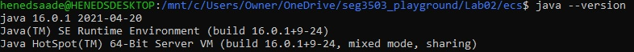
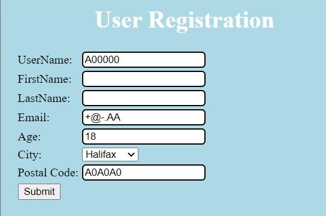
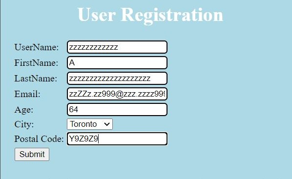
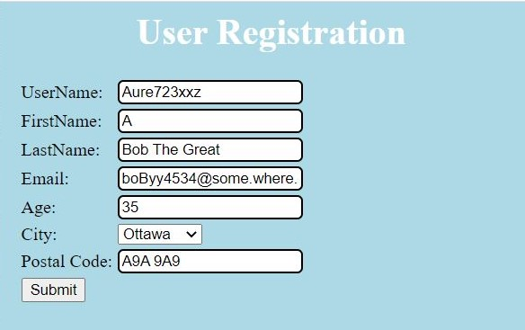
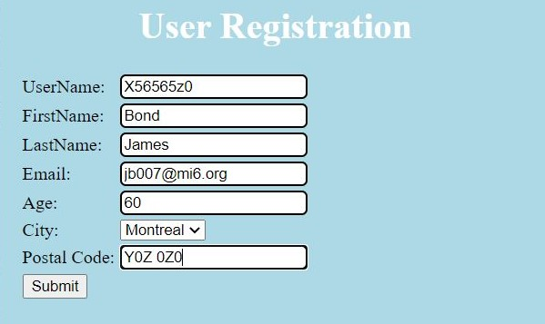
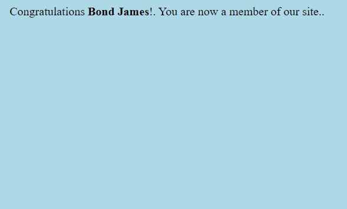
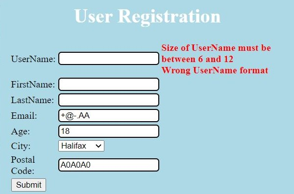
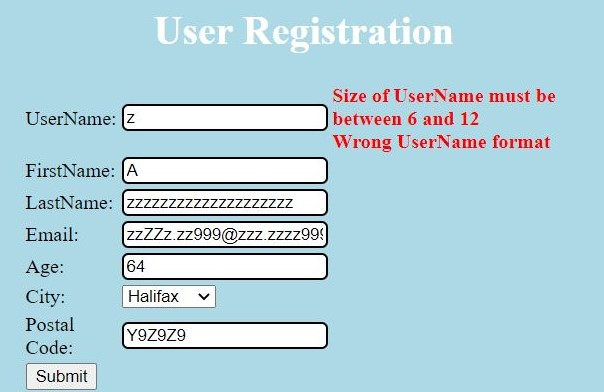
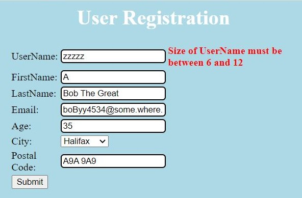
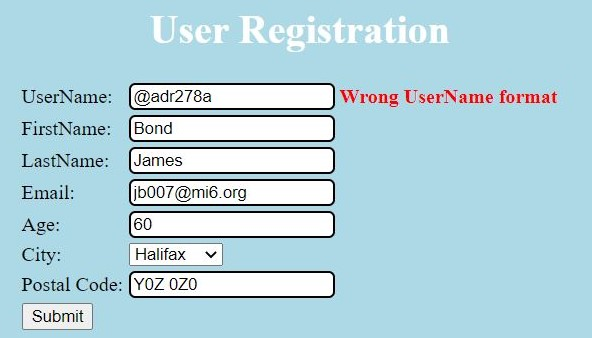

# SEG3503 Laboratory 2

| Information | Value |
| --- | --- |
| Course | SEG 3503 |
| Semester | Summer 2021 |
| Professor | Andrew Forward |
| TA | Aymen Mhamdi |
| Student | Hened Saade (3000111592) |

This is the second laboratory for the course SEG3103.

I am running Java openjdk 16.0.1



## Exercise 1:

I am running jar file 'user-registration-app-0.1.0.jar' (in `registration`):

```bash
java -jar  user-registration-app-0.1.0.jar
```


I used the test cases given in the tutorial

Here is the results:

Test Case |  Expected Results             | Actual Results                   | Verdict(Pass, Fail, Inconclusive)
----------|-------------------------------|----------------------------------|----------------------------------
1         | registration request accepted | registration request accepted    | Pass
2         | registration request accepted | registration request accepted    | Pass
3         | registration request accepted | registration request accepted    | Pass
4         | registration request accepted | registration request accepted    | Pass
5         | Err1                          | Err1 and Err3                    | Fail
6         | Err3                          | Err1 and Err3                    | Fail
7         | Err3                          | Err3                             | Pass
8         | Err1                          | Err1                             | Pass














To run the tests, I use the command

```bash
bin/test
```

Here is the result:


